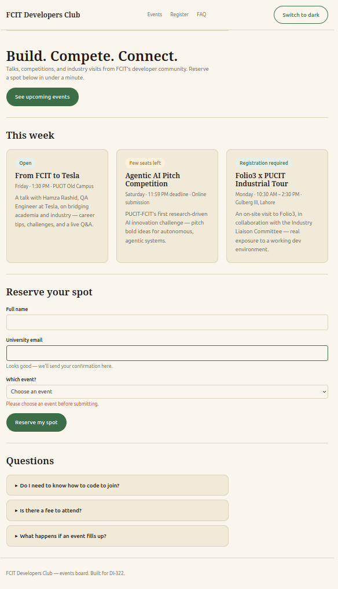
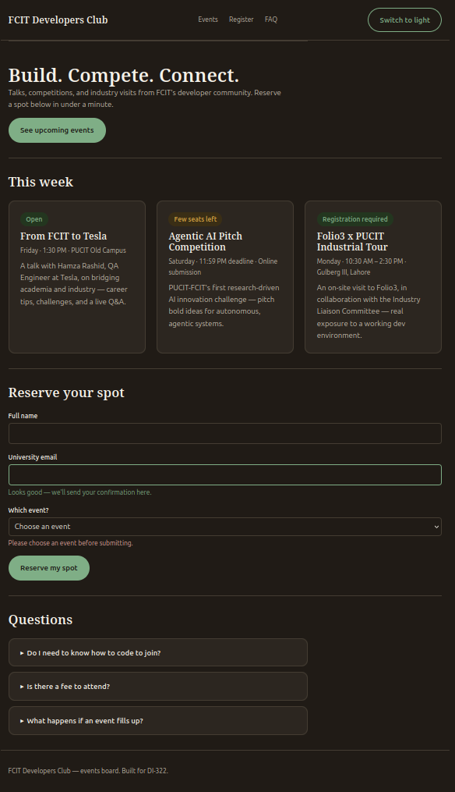

# FCIT Developers Club — Assignment 01

## Product goal
An events and registration board for the FCIT Developers Club. A student
should be able to see upcoming club events, understand which need
registration, reserve a spot through a short form, and check common
questions — all from one page.

## Design-system decisions
Tokens are split into three levels, per the course reading:
- **Primitives** (`--clr-*`): raw palette values, no meaning attached.
- **Semantic roles** (`--surface-page`, `--action`, `--error`, etc.): the
  names every component actually uses. A theme is just a new set of values
  assigned to these same role names.
- No component-level tokens were needed yet — the semantic roles were
  specific enough for every component in this scope.

Palette: a warm cork/paper neutral (light theme) / ink-dark neutral (dark
theme), a chalkboard-green action color, and a marigold secondary accent —
chosen to read as a physical campus bulletin board rather than a generic
SaaS palette. Fraunces (display serif) for headings, Inter (sans) for body,
to separate "poster" text from reading text.

## File architecture
```
index.html                    the real page
design-system/specimen.html   token + component reference page
design-system/tokens.css      all color/spacing/radius/type tokens, both themes
design-system/components.css  every reusable component and its states
styles/reset.css              layer order declaration + browser reset
styles/base.css               default typography, global focus style
styles/layout.css             placement: page shell, header, card grid, section rhythm
styles/page.css               small utilities + this-page-only overrides
styles/theme.js               optional theme toggle (< 30 lines)
```
Cascade layer order (declared once in `reset.css`):
`reset, tokens, base, layout, components, utilities, overrides`

## Component contracts
- **`.card`** — semantic element `<article>` (must be self-contained).
  Optional `.badge[data-status="open|limited|full"]` child; status is always
  paired with text, never color alone. Consumes `--surface-card`,
  `--border-default`, `--action`.
- **`.field`** — wraps a `<label for>` + `<input>`/`<select>` pair.
  `data-state="success"|"error"` on the wrapper drives both the border color
  and the paired `.field__hint` message.
- **`.faq-item`** — native `<details>`/`<summary>`, no JS. Styling only
  changes appearance; open/close and keyboard behavior come from the browser.
- **`.button`** — `.button--secondary` modifier for lower-emphasis actions.
  States: default, `:hover`, `:active`, `:disabled`.

Naming convention: BEM-style modifiers for fixed variants (`.button--secondary`),
`data-*` attributes for runtime/content state (`data-status`, `data-state`) —
kept separate so "what kind of thing is this" and "what state is it in right
now" don't get mixed into one class name.

## Theme strategy
Two full role sets in `tokens.css`, switched via `[data-theme="light|dark"]`
on `<html>`. `prefers-color-scheme` provides the same dark values automatically
when no explicit choice has been made. `theme.js` only toggles the attribute
and remembers the choice in `localStorage` — it never sets a color itself.

## One cascade problem I solved
I checked in DevTools if my cascade layers are actually working. I
inspected the .card element and it showed the rule is coming from
components.css line 67, inside @layer components, and nothing else was
crossing it out or fighting with it. This is what I wanted to happen —
since I wrote @layer reset, tokens, base, layout, components, utilities,
overrides at the top of reset.css, a rule in layout.css can never beat a
rule in components.css no matter what, because components comes after
layout in that list. Without this layer order, my card-list layout rule
and my card component rule could have clashed depending on which selector
was "stronger," and I'd have had to fix it with specificity tricks instead.

## One box-model measurement
I inspected my event card in Firefox's Layout tab and looked at the box
diagram. It showed:
- content: 214.333px by 249.6px
- padding: 24px all around
- border: 1px all around
- margin: 0

So the real width of the card on screen is 214.333 + 48 (padding both
sides) + 2 (border both sides) = 264.3px. This matches what I expected
because I used box-sizing: border-box in reset.css, so the padding and
border don't get added on top of a separate width — they're already
included.

## Browser tests
I tested the page in Firefox. The theme toggle switches between light and
dark right away and it stays on dark even after I refresh the page. The
FAQ questions open and close fine when I click them. I also checked the
Console tab and there were no errors.

## Screenshots
### Light theme


### Dark theme
